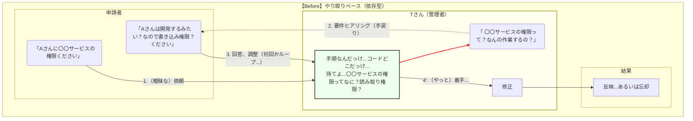
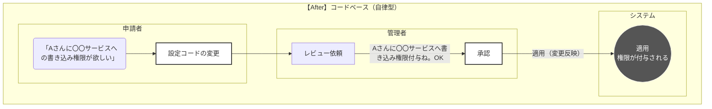

- before

```mermaid
graph TB

subgraph Flow_Chat [【Before】やり取りベース（依存型）]
    subgraph Client [申請者]
        direction TB
        C1(「Aさんに〇〇サービスの権限ください」)
        C2(「Aさんは開発するみたい？なので書き込み権限？ください」)

        %% 【強制縦並び用の支柱】 Aの下にFが来るようにする
        C1 --- C2
    end

    subgraph BlackBox [Tさん（管理者）]
        direction LR
        B1[手順なんだっけ...コードどこだっけ...<br>待てよ...〇〇サービスの権限ってなに？読み取り権限？]
        B2(「 〇〇サービスの権限って？なんの作業するの？」)
        B3[修正]

        %% 【強制縦並び用の支柱】 Bの下にC、Cの下にDが来るようにする
        B1 --- B2
        B1 --- B3
        %%B2 --- B3
    end

    subgraph Output [結果]
        O1[反映...あるいは忘却]
    end

    C1 -->|1.（曖昧な）依頼| B1
    B1 --> B2
    B2 -.->|2. 要件ヒアリング（手戻り）| C2

    B3 --> O1
    B1 -->|4'.（やっと）着手...| B3

    C2 -->|3. 回答、調整（何回かループ...）| B1
end
    %% スタイル定義
    style BlackBox fill:#ffe,stroke-width:2px
    style B1 fill:#efe,stroke:#333,stroke-width:2px
    linkStyle 4 stroke:#f00,stroke-width:2px,color:red;

    %% 【重要】支柱（構造用の線）を透明にして見えなくする
    %% 最初に定義した3本（A-F, B-C, C-D）を消す設定
    linkStyle 0,1,2 stroke-width:0px,fill:none;
```

- after

```mermaid
graph TB
subgraph Flow_Code [【After】コードベース（自律型）]
    subgraph User [申請者]
        direction TB
        U1(「Aさんに〇〇サービスへの書き込み権限が欲しい」)
        U2[設定コードの変更]
    end

    subgraph Admin [管理者]
        A1[レビュー依頼]
        A2[承認]
    end

    subgraph System [システム]
        S1((適用<br>権限が付与される))
    end

    U1 --> U2
    U2 --> A1
    A1 -->|Aさんに〇〇サービスへ書き込み権限付与ね。OK| A2
    A2 -->|適用（変更反映）| S1
end
    style U2 fill:#fff,stroke:#333,stroke-width:2px
    style A2 fill:#fff,stroke:#333,stroke-width:2px
    style S1 fill:#555,stroke:#fff,color:#fff
```
