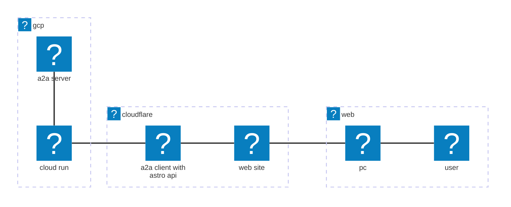

- content-search
a2a server and client

```mermaid
architecture-beta
    group server(logos:google-cloud)[gcp]

    service cloudrun(logos:google-cloud-run)[cloud run] in server
    service python(logos:python)[a2a server] in server

    %%bq1:L -- R:dlt
    %%bq2:L <-- R:bq1
    %%dbt:B -- T:bq2
    user:L -- R:pc
    astro:R -- L:pc
    api:R -- L:astro
    cloudrun:R -- L:api
    python:B -- T:cloudrun
    %%api:L <-- R:bq2

    group cloudflare(logos:cloudflare-icon)[cloudflare]

    service astro(logos:astro-icon)[web site] in cloudflare 
    service api(mdi:api)[a2a client with astro api] in cloudflare 

    group web(mdi:web)[web]

    service user(mdi:account)[user] in web 
    service pc(mdi:computer)[pc] in web
```