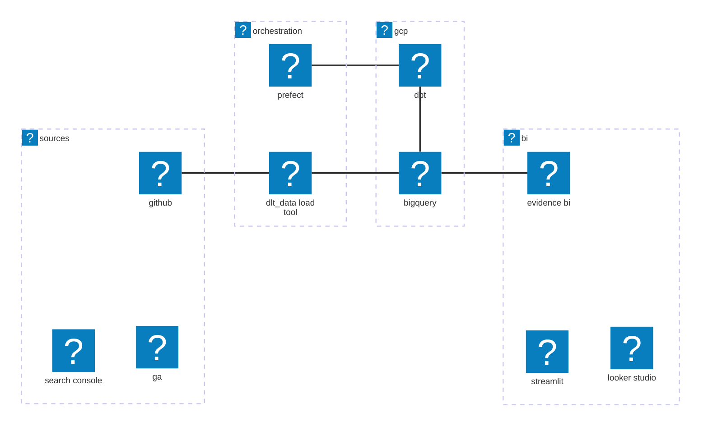

- blog-dashboard

```mermaid
architecture-beta
    group pipeline(mdi:cloud-outline)[orchestration]

    service prefect(mdi:alpha-p-circle)[prefect] in pipeline
    service dlt(mdi:alpha-d-circle)[dlt_data load tool] in pipeline

    dlt:L -- R:gh
    bq:L -- R:dlt
    dbt:L -- R:prefect
    dbt:B -- T:bq
    evidence:L -- R:bq

    group analytics(mdi:chart-line)[bi]

    service ls(logos:google-data-studio)[looker studio] in analytics
    service evidence(mdi:alpha-e-circle)[evidence bi] in analytics
    service st(logos:streamlit)[streamlit] in analytics

    group dwh(logos:google-cloud)[gcp]

    service bq(mdi:database-outline)[bigquery] in dwh
    service dbt(logos:dbt-icon)[dbt] in dwh

    %%dwh:L -- R:storage1
    %%dwh:L -- R:storage1_log

    %%dwh:L -- R:storage2
    %%dwh:L -- R:storage2_log

    group sources(mdi:storage)[sources]
    service ga(logos:google-analytics)[ga] in sources
    service sc(logos:google-search-console)[search console] in sources
    service gh(logos:github-icon)[github] in sources


```

