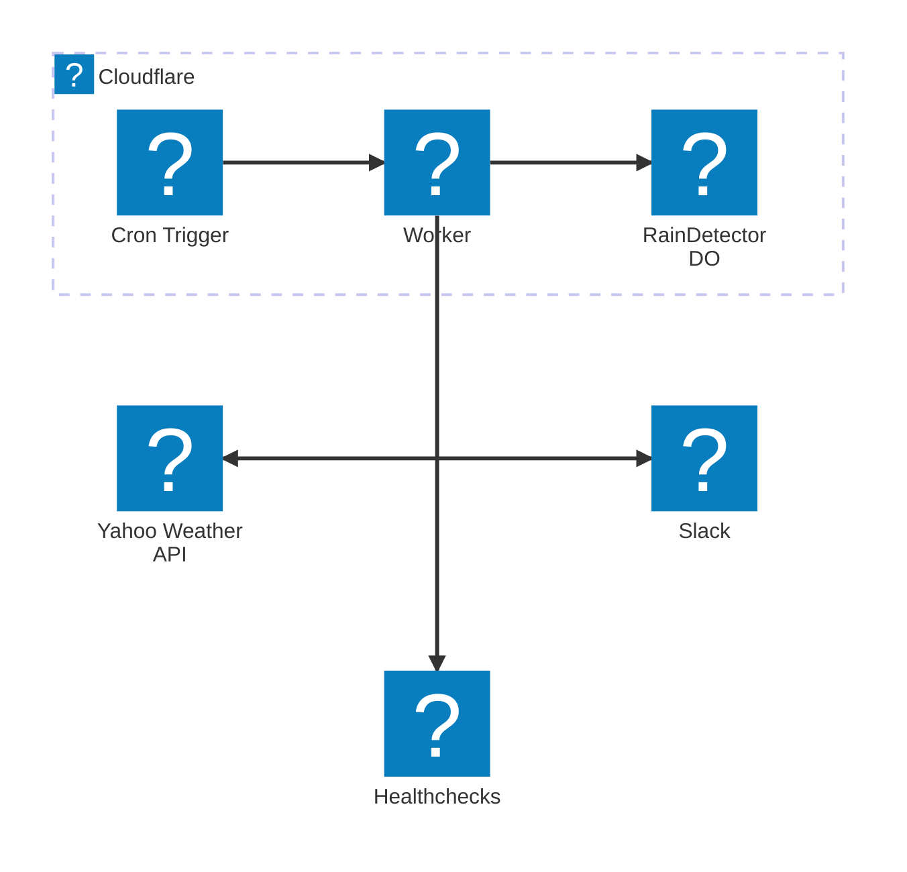
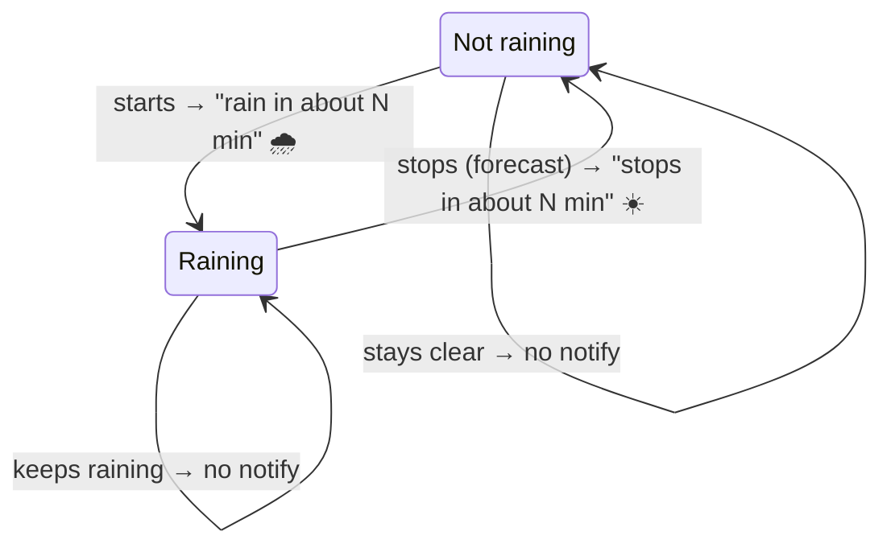

- archtecture

```mermaid
architecture-beta
  group cloudflare(logos:cloudflare)[Cloudflare]

  service cron(mdi:clock-outline)[Cron Trigger] in cloudflare
  service worker(logos:cloudflare-workers-icon)[Worker] in cloudflare
  service rainDO(mdi:database)[RainDetector DO] in cloudflare

  service yahoo(logos:yahoo)[Yahoo Weather API]
  service slack(logos:slack-icon)[Slack]
  service hc(mdi:heart-pulse)[Healthchecks]

  junction j %% workerから出す矢印の交点

  cron:R --> L:worker
  worker:R --> L:rainDO
  worker:B -- T:j
  j:L --> R:yahoo
  j:R --> L:slack
  j:B --> T:hc
```

- State management

```mermaid
stateDiagram-v2
  state "Not raining" as dry
  state "Raining" as rain
  dry --> rain: starts → "rain in about N min" 🌧️
  rain --> dry: stops (forecast) → "stops in about N min" ☀️
  rain --> rain: keeps raining → no notify
  dry --> dry: stays clear → no notify
```
