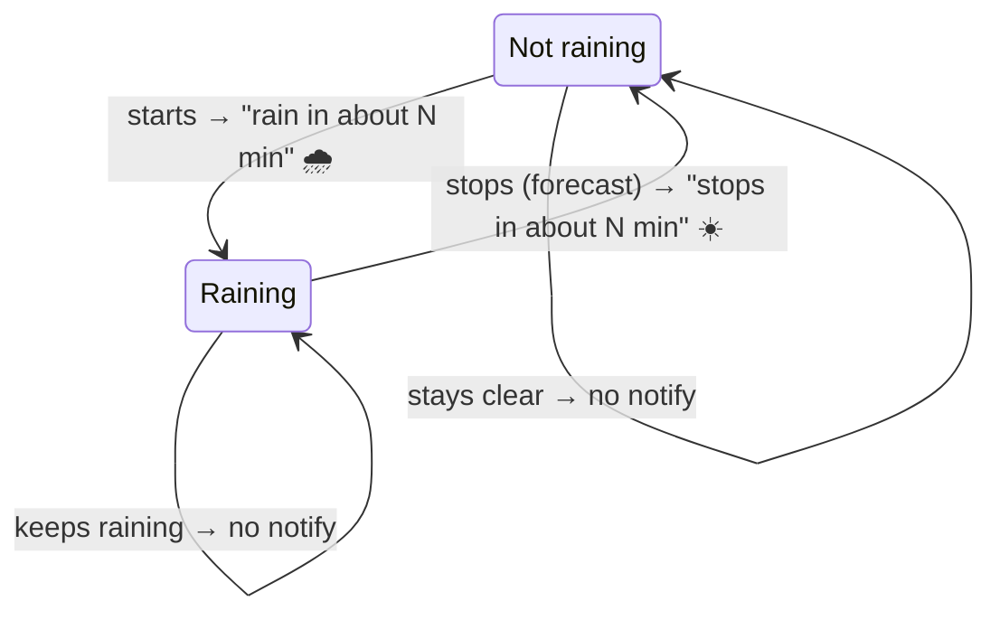

- State management

```mermaid
stateDiagram-v2
  state "Not raining" as dry
  state "Raining" as rain
  dry --> rain: starts → "rain in about N min" 🌧️
  rain --> dry: stops (forecast) → "stops in about N min" ☀️
  rain --> rain: keeps raining → no notify
  dry --> dry: stays clear → no notify
```
