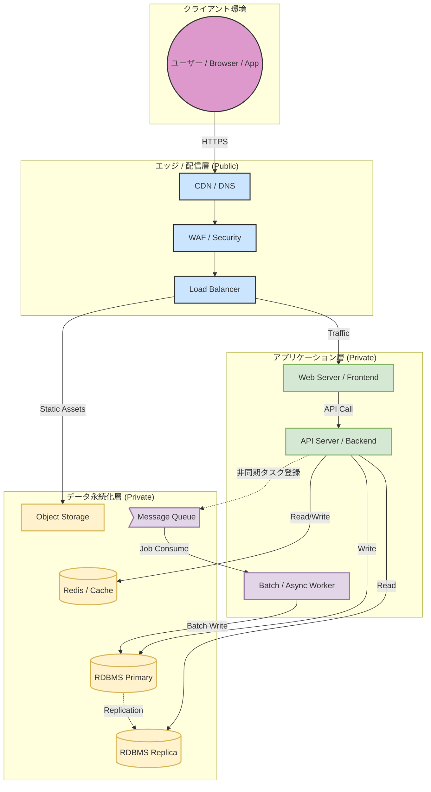
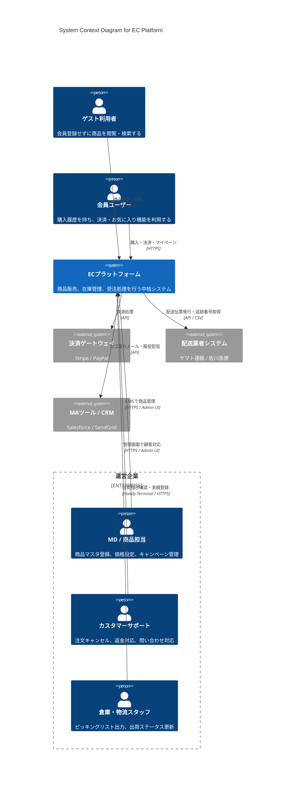
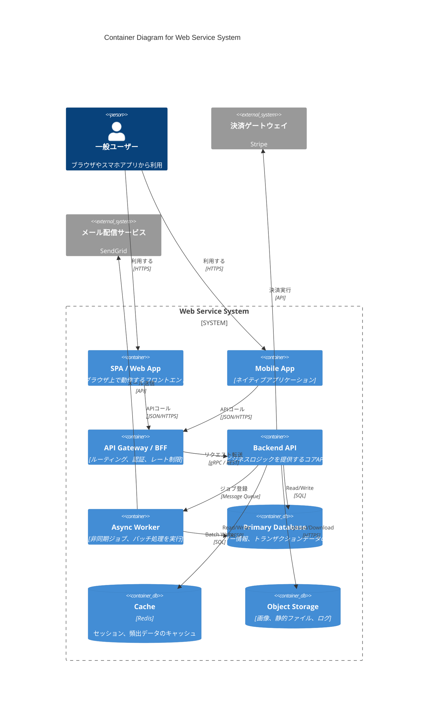
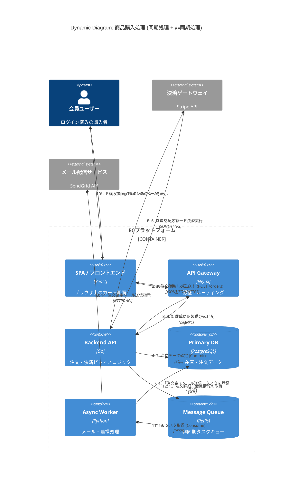

c4 diagramの練習用

geminiに教えてもらった

```
レベル,名前,地図での例え,誰に見せる図？,何を描く？
Level 1,System Context(システムコンテキスト),世界地図,経営者・非エンジニア全ステークホルダー,システム全体と、ユーザーや外部システムとの関係。技術用語は使いません。
Level 2,Container(コンテナ),市町村地図,アーキテクト・開発リーダーインフラ担当,Webサーバー、DB、スマホアプリなど「個別にデプロイ・実行される単位」。一番よく使われます。
Level 3,Component(コンポーネント),詳細な街路図,開発者,1つのコンテナ（例：APIサーバー）の中身。「Controller」「Service」「Repository」などの構成要素。
Level 4,Code(コード),建物の設計図,開発者,クラス図やER図。細かすぎるため、手書きすることは稀で、ツールで自動生成するのが一般的です。
```

- アーキテクチャ

中〜大規模なECサイト（オンラインショップ）

<details><summary>詳細</summary>

サービス概要：ECサイト（オンラインストア）
ユーザーが商品の閲覧、カートへの追加、購入（決済）、そして注文完了メールを受け取るまでの機能を備えたWebサービスです。

1. エッジ・配信層 (CDN / LB)
「商品画像の高速表示」

役割: ユーザーはきれいな商品写真やバナー画像を大量に見ます。これらをWebサーバーがいちいち配信すると負荷が高すぎるため、CDNにキャッシュさせて、世界中どこからでも爆速で表示させます。

WAF: クレジットカード情報を扱うため、攻撃（SQLインジェクションなど）をここでブロックします。

2. アプリケーション層 (API / Web)
「買い物かごとレジ機能」

Web Server (BFF): スマホアプリやPCブラウザからのリクエストを受け付け、画面を表示するためのHTMLやJSONを返します。

API Server: 「在庫はあるか？」「クーポンの期限は切れていないか？」「合計金額はいくらか？」といった計算（ビジネスロジック）を行います。セール時などアクセスが集中したときは、ここの台数を自動で増やします（オートスケール）。

3. データ層 (Cache / DB)
「商品カタログとカートの中身」

Cache (Redis): **「カートの中身」や「ログイン中のユーザー情報」**をここに置きます。DBにいちいち問い合わせると遅いので、メモリ上で高速に出し入れします。

DB Replica (参照用): **「商品一覧の表示」**に使います。見るだけの人は圧倒的に多いので、参照専用のDBを複数用意して負荷を分散します。

DB Primary (書込用): **「購入確定（在庫を減らす）」**という絶対に間違ってはいけない処理だけは、親玉であるPrimary DBで行います。

4. 非同期・バッチ層 (Worker / Queue)
「注文完了メールと発送手配」

ユーザーが「購入」ボタンを押した瞬間、システムは「購入完了画面」を即座に出したいと考えます。

しかし裏側では、「メールを送る」「倉庫に出荷指示データを送る」「ポイントを付与する」など、時間がかかる仕事が残っています。

そこで、「とりあえず購入は受付済み」というメモをQueueに入れ、ユーザーにはすぐ「完了」を表示します。

裏で待機しているWorkerが、Queueからメモを取り出し、「メール送信」や「外部物流システムへの連携」をゆっくり確実に実行します。

</details>



- level1



- level2




- level2 商品購入フローのダイナミック図


