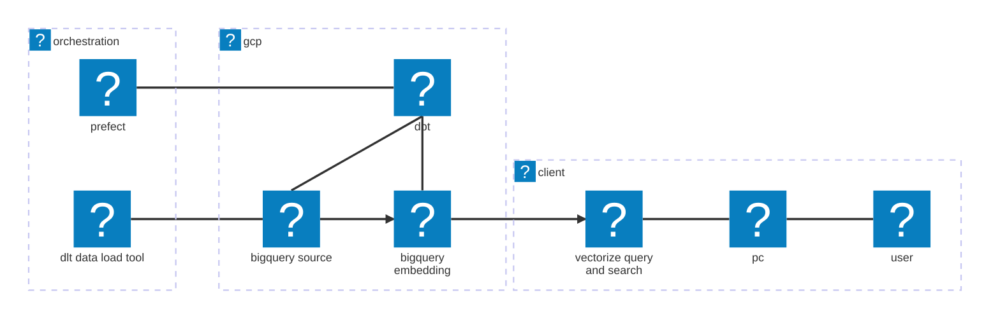

- vector-search(batch and search from browser)

```mermaid
architecture-beta
    group pipeline(mdi:cloud-outline)[orchestration]

    service prefect(mdi:alpha-p-circle)[prefect] in pipeline
    service dlt(mdi:alpha-d-circle)[dlt data load tool] in pipeline

    bq1:L -- R:dlt
    dbt:L -- R:prefect
    dbt:B -- T:bq1
    bq2:L <-- R:bq1
    dbt:B -- T:bq2
    user:L -- R:pc
    pc:L -- R:api
    api:L <-- R:bq2

    group web(mdi:web)[client]

    service user(mdi:account)[user] in web 
    service pc(mdi:computer)[pc] in web 
    service api(mdi:api)[vectorize query and search] in web 

    group dwh(mdi:cloud-outline)[gcp]

    service bq1(mdi:database-outline)[bigquery source] in dwh
    service bq2(mdi:database-outline)[bigquery embedding] in dwh
    service dbt(logos:dbt-icon)[dbt] in dwh
```

